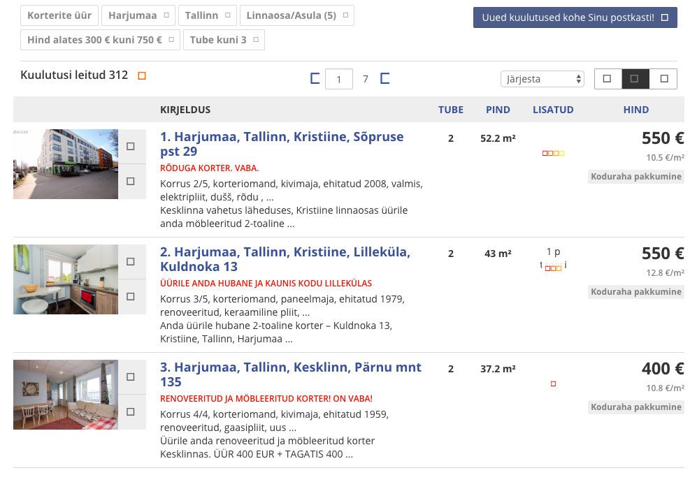

# flatcrawl

[](https://circleci.com/gh/madis/flatcrawl)

Clojure app for crawling apartment information from http://kv.ee

> Using this project to learn more about Clojure with the possibility that it
> might grow into something more useful

## Example

Search results look like:


Flatcrawl gives you:

```clojure
flatcrawl.import-test=> (take 3 (get-titles (html/html-resource "fixtures/search_results_page-1.html")))
("1. Harjumaa, Tallinn, Kristiine, Sõpruse pst 29"
 "2. Harjumaa, Tallinn, Kristiine, Lilleküla, Kuldnoka 13"
 "3. Harjumaa, Tallinn, Kesklinn, Pärnu mnt 135")
```
